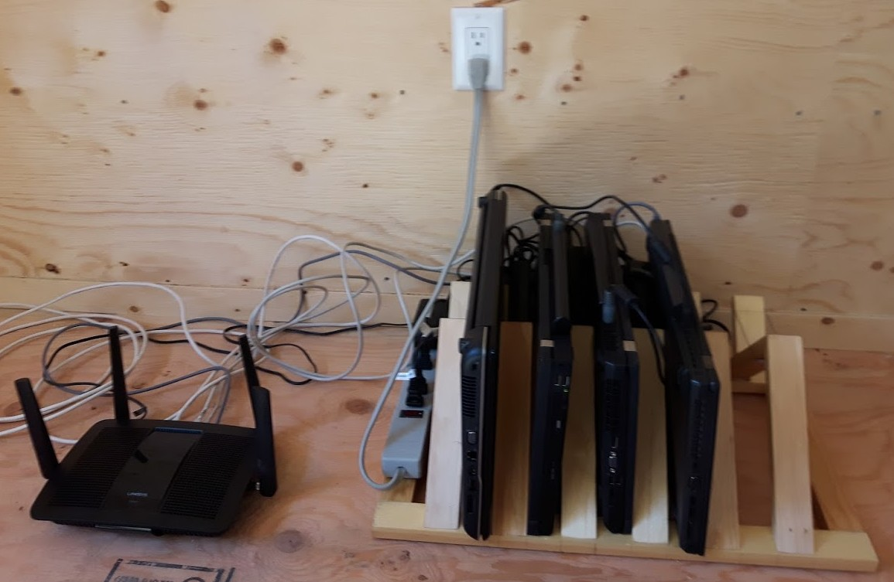

= Cluster For Clouds Using Kubernetes™
Alan Conway
:prewrap!:
:toc: preamble

The *ClusterFCUK*™ (formerly know as the Old Crap Cluster™) is a
bare-metal kubernetes cluster consisting of discarded laptops running
Fedora 30. This describes how I set it up, for anyone who cares about
such things.

[quote, Magnus Pinguis Mendacium] 
If you can make it run on the ClusterFCUK, you can make it run *anywhere*.

'''

== Setting up the cluster

Plargarised from the kubeadm
guide.footnote:[From https://kubernetes.io/docs/setup/independent/install-kubeadm,
https://kubernetes.io/docs/setup/independent/create-cluster-kubeadm]
and other sources.

Most steps are done over `ssh` from a separate "console"
workstation. All hosts (console and servers) must be able to resolve
each other’s names on your network. I use my router's built-in DNS,
another option is to set up static IPs in `/etc/hosts`.

Configuration files:

- `./config/` kubernetes config files.
- `./etc/`  files to be copied to /etc on cluster servers.

You should review all the config files, you probably need to modify
these for your network:

- `./config/metallb.yml`(give the load balancer a safe address range)
- `./etc/hosts`(if using static IP addresses)

=== Prepare the console

My servers are called `master`, `node1`, `node2` and `node3`, adjust
for your servers. Set the console environment as follows:
....
export HOSTS="master node1 node2 node3"
....

Install `ssh` and the kubernetes client
....
sudo dnf install -y openssh-clients kubernetes-client
....

Set up an ssh key-pair for certificate-based login, for example using
http://fedoranews.org/dowen/sshkeys/[this guide].

Prepare the servers
~~~~~~~~~~~~~~~~~~~

Log into each each to server enable ssh and disable suspend (for laptops).
Note this should be the last time you need to touch the servers.

....
# On each server
sudo hostnamectl set-hostname # set an appropriate name
systemctl enable --now sshd
systemctl mask --now sleep.target suspend.target hibernate.target hybrid-sleep.target
....

NOTE: The remaining steps are done from the console.

Enable no-password ssh login for self and root.

- You need an SSH key pair in `$HOME/.ssh` on the console workstation.
- You’ll have to enter passwords this one time, but no more.

....
for h in $HOSTS; do
    ssh-copy-id $h
    ssh $h sudo -S cp -r $HOME/.ssh /root
done
....

Disable swapping (required by `kubeadm`) and firewalls:

....
for h in $HOSTS; do
    ssh root@$h swapoff -a # kubeadm wants no swapping
    ssh root@$h "sed -i -E 's/(^.*\\<swap\\>.*$)/# \\1/' /etc/fstab"
    ssh root@$h systemctl mask firewalld
done
....

NOTE: In theory you can keep the firewalls running with a
https://kubernetes.io/docs/setup/independent/install-kubeadm/#check-required-ports[limited set of ports].
I haven't tried it yet.

Upgrade packages

....
for h in $HOSTS; do
    ssh -n root@$h dnf -y update&
done
wait; echo done
....

=== Install packages

NOTE: Fedora `docker` package is https://kubernetes.io/docs/setup/cri[too old] for k8s. +
On Fedora 30 use package `moby-engine` 

Remove old docker package and config if installed:

....
for h in $HOSTS; do
    ssh -n root@$h 'dnf erase -y docker docker-* && rm -rf /etc/docker'
done
....

Install packages.

....
for h in $HOSTS; do
    ssh -n root@$h dnf -y install moby-engine containerd ipvsadm kubernetes-kubeadm&
done
wait; echo done
for h in $HOSTS; do
    ssh root@$h 'systemctl enable --now docker kubelet'
done
....

NOTE: kubelet will report errors in the system log file until the master is initialized in the next section.

Cluster configuration
~~~~~~~~~~~~~~~~~~~~~

Copy configuration files from ./etc

....
for h in $HOSTS; do scp -r etc root@$h:/; done
....

Initialize master, copy merge administrator config into ~/.kube/config
....
ssh -lroot master kubeadm init --pod-network-cidr=10.244.0.0/16 --ignore-preflight-errors=SystemVerification
scp root@master:/etc/kubernetes/admin.conf $HOME/.kube/occ.config
( cd $HOME/.kube; KUBECONFIG=config:occ.config kubectl view > config; )
....

Install network overlay. I used `flannel`, there are
https://kubernetes.io/docs/setup/independent/create-cluster-kubeadm/#pod-network[other options].

* `--pod-network-cidr=10.244.0.0/16` is for flannel. +
* `--ignore-preflight` is to ignore _unsupported kernel version_ warnings.

....
kubectl apply -f https://raw.githubusercontent.com/coreos/flannel/master/Documentation/kube-flannel.yml
bin/wait-pods --all-namespaces
....

Join nodes using a generated token from the master:

....
JOIN_CMD="$(ssh master kubeadm token create --print-join-command)  --ignore-preflight-errors=SystemVerification"
for h in node1 node2 node3; do
    ssh root@$h $JOIN_CMD
    ssh root@$h mkdir -p /etc/kubernetes/manifests
done
bin/wait-pods --all-namespaces
kubectl get nodes
....

Install a load balancer. I picked metallb - https://metallb.universe.tf/

NOTE: you must update `config/metallb.yml` for your network.

....
kubectl apply -f https://raw.githubusercontent.com/google/metallb/v0.8.0/manifests/metallb.yaml
kubectl apply -f config/metallb.yml
bin/wait-pods --all-namespaces
....

Test the cluster
~~~~~~~~~~~~~~~~

Deploy hello-world:

....
kubectl create deployment hello-node --image=gcr.io/hello-minikube-zero-install/hello-node
....

Expose hello-world as a NodePort - does not require a load balancer.

....
kubectl expose deployment hello-node --type=NodePort --port=8080
PORT=$(kubectl get svc hello-node -o=jsonpath='{.spec.ports[?(@.port==8080)].nodePort}')
curl master:$PORT
kubectl delete svc hello-node
....

Expose hello-world as a LoadBalancer - needs a load balancer configured.

....
kubectl expose deployment hello-node --type=LoadBalancer --port=8080
kubectl get svc hello-node # Wait till it has an external IP
IP_ADDR=$(kubectl get svc hello-node -o=go-template='{{index .status.loadBalancer.ingress 0 "ip"}}')
curl $IP_ADDR:8080
kubectl delete deployment hello-node
....

Run Sonobuoy compliance check from https://github.com/heptio/sonobuoy

....
go get github.com/heptio/sonobuoy

# Quick test set
sonobuoy run --wait --mode quick
sonobuoy e2e $(sonobuoy retrieve)

# Full test set
sonobuoy run --wait
sonobuoy e2e $(sonobuoy retrieve)

# Cleanup
sonobuoy delete --wait --all
....

NOTE: No idea what this checks, but it passed so we are _compliant_!

Use a private docker registry
~~~~~~~~~~~~~~~~~~~~~~~~~~~~~

To use your own `dockerhub.io` account as a registry for your cluster.footnote:[From https://kubernetes.io/docs/concepts/containers/images/#using-a-private-registry]

....
docker login # Adds credentails to ~/.docker/config.json
for h in $HOSTS; do
    scp ~/.docker/config.json root@$h:/var/lib/kubelet/config.json
done
....

Now you can pull images using your dockerhub username as the repository.

Adding useful features
----------------------

First create an admin service account for use in other installs.

....
kubectl apply -f config/admin.yml
....

Kubernetes dashboard
~~~~~~~~~~~~~~~~~~~~

Apply dashboard as admin, copy token so you can log in via `~/.kube/config`

....
kubectl apply -f https://raw.githubusercontent.com/kubernetes/dashboard/v1.10.1/src/deploy/recommended/kubernetes-dashboard.yaml
TOKEN=$(kubectl -n kube-system describe secret admin | awk '$1=="token:"{print $2}')
kubectl config set-credentials kubernetes-admin --token="${TOKEN}"
kubectl proxy &
xdg-open 'http://localhost:8001/api/v1/namespaces/kube-system/services/https:kubernetes-dashboard:/proxy/#!/login'
....

Install Knative serving and eventing from repo
~~~~~~~~~~~~~~~~~~~~~~~~~~~~~~~~~~~~~~~~~~~~~~

....
docker login
export KO_DOCKER_REPO=$(docker info | awk '/Username: / {print $2}')
PATH=$PATH:$PWD/bin

cd $HOME/go/src/github.com/knative
# Set a branch/tag
# REV=master for d in *; do git -C $d checkout $REV; done

# ISTIO
kubectl apply -f serving/third_party/istio-1.1-latest/istio-crds.yaml
wait-crd gateways.networking.istio.io
kubectl apply -f serving/third_party/istio-1.1-latest/istio.yaml
wait-pods --all-namespaces

# Cert manager
kubectl apply -f serving/third_party/cert-manager-0.6.1/cert-manager-crds.yaml
wait-crd certificates.certmanager.k8s.io
kubectl apply -f serving/third_party/cert-manager-0.6.1/cert-manager.yaml --validate=false
wait-pods --all-namespaces

# Serving
ko apply -f serving/config/ && wait-pods --all-namespaces
ko apply -f serving/config/monitoring && wait-pods --all-namespaces

# Logging and monitoring
kubectl apply -R -f serving/config/monitoring/100-namespace.yaml && wait-pods --all-namespaces
kubectl apply -R -f serving/third_party/config/monitoring/logging/elasticsearch && wait-pods --all-namespaces
kubectl apply -R -f serving/config/monitoring/logging/elasticsearch && wait-pods --all-namespaces
kubectl apply -R -f serving/third_party/config/monitoring/metrics/prometheus && wait-pods --all-namespaces
kubectl apply -R -f serving/config/monitoring/metrics/prometheus && wait-pods --all-namespaces
kubectl apply -R -f serving/config/monitoring/tracing/zipkin && wait-pods --all-namespaces

# Eventing
ko apply -f eventing/config/ && wait-pods --all-namespaces
ko apply -f eventing/config/provisioners/in-memory-channel/ && wait-pods --all-namespaces
ko apply -f eventing-sources/config/ && wait-pods --all-namespaces

# Run eventing end-to-end tests
cd eventing
sh test/upload-test-images.sh latest
time go test -v -tags=e2e -count=1 -short -parallel=1 ./...
....

== Openshift (TBD)

Tried using openshift-under-kubernetes helper to install openshift.

....
pip install --user openshift-under-kubernetes
openshift-under-kubernetes --context kubernetes-admin@kubernetes deploy --load-balancer --create-volume
....

No joy yet - failed to create storage volume - need to create separately?

= Re-setting the cluster

This should shut down your cluster and remove all config changes made by
kubeadm:

....
for h in node1 node2 node3; do kubectl delete node $h; done
for h in $HOSTS; do
    ssh root@$h kubeadm reset --force
    ssh root@$h 'iptables -F && iptables -t nat -F && iptables -t mangle -F && iptables -X && ipvsadm --clear'
    ssh root@$h reboot now
done
....

Other resources
---------------

The following guides are similar to this one, but I found them too late to benefit:

* https://unofficial-kubernetes.readthedocs.io/en/latest/getting-started-guides/kubeadm/
* https://developer.ibm.com/tutorials/developing-a-kubernetes-application-with-local-and-remote-clusters/
